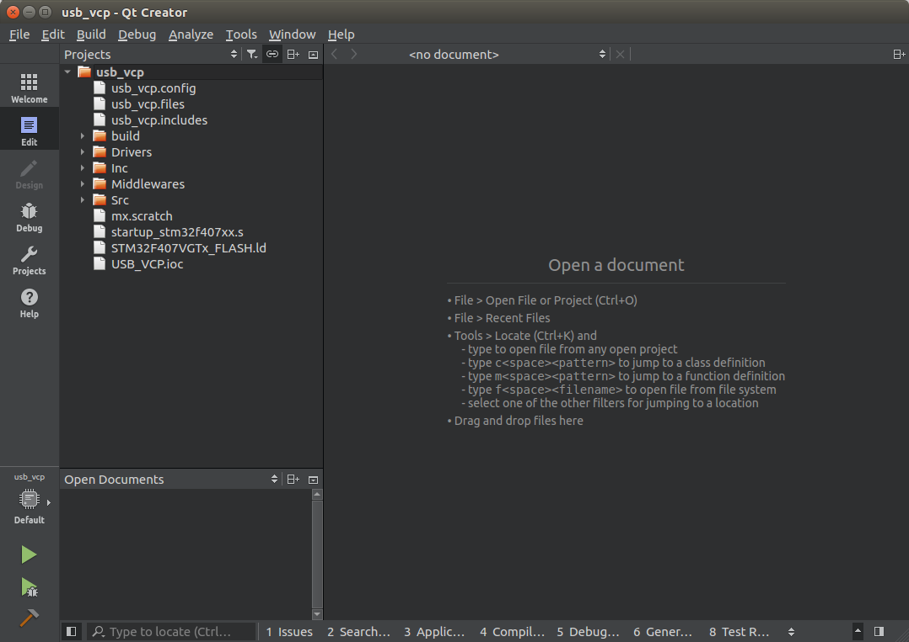
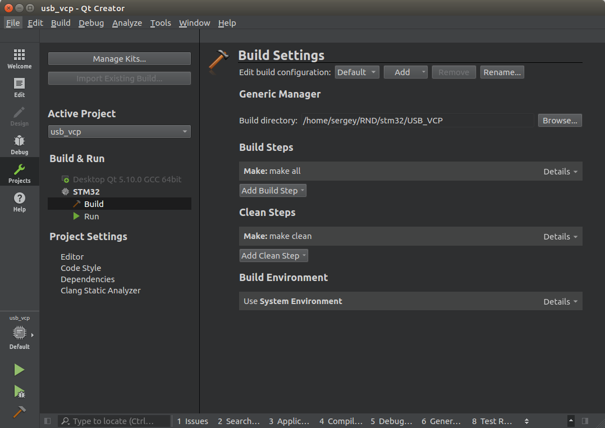
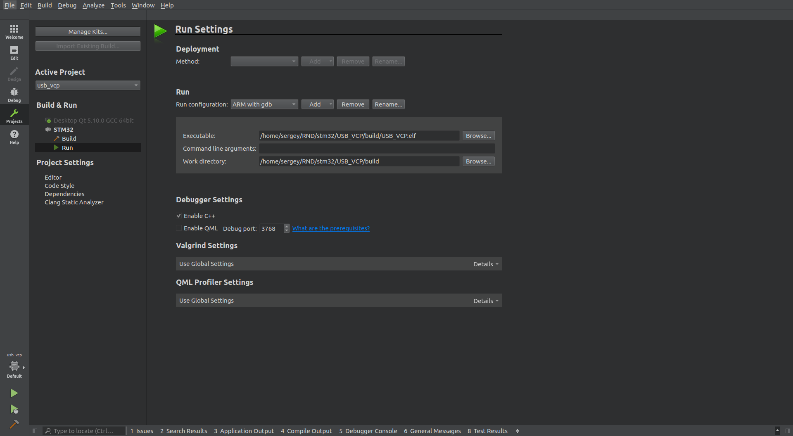
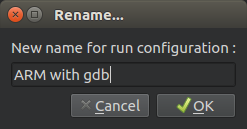
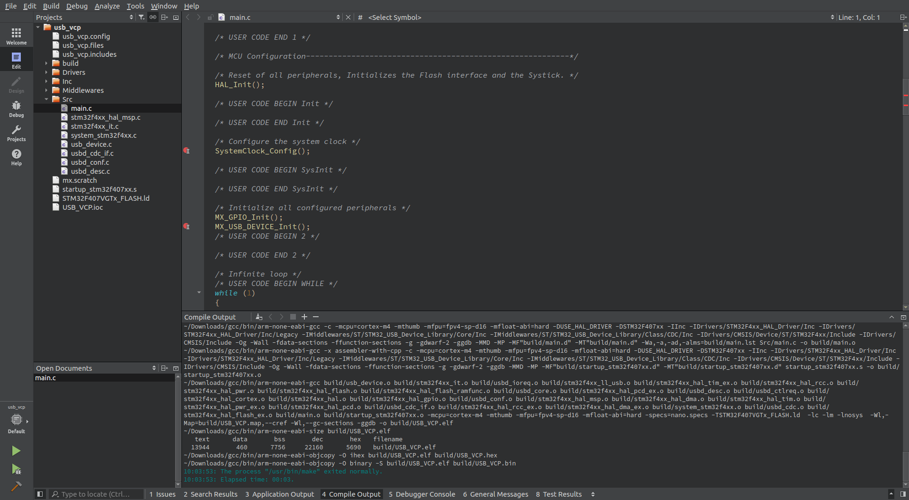
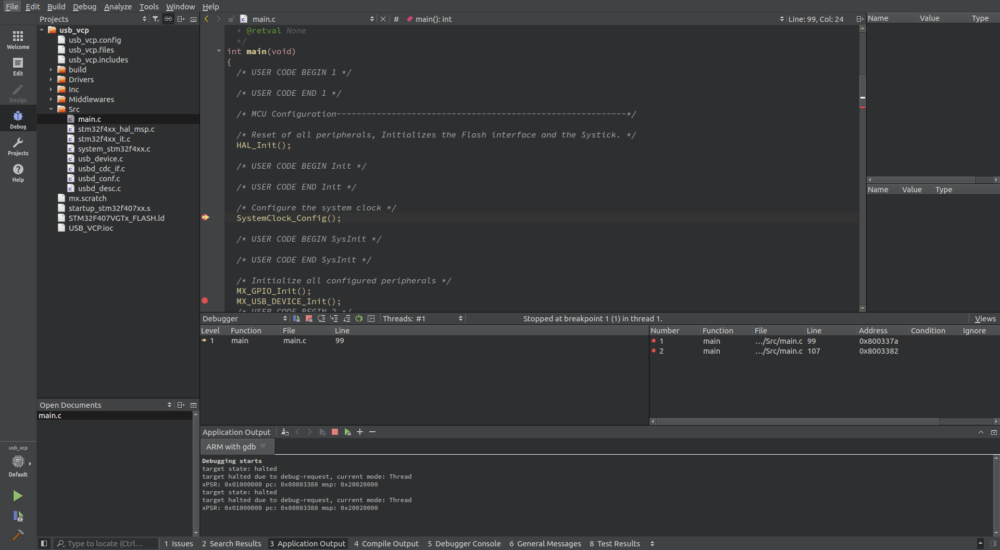

# On-chip debugging STM32 with QtCtreator
In this chapter, we will start on-chip debugger with help QtCreator IDE. Also, you will see how to to do it various ways.  

1. Open usb_vcp project with QtCreator  
  

2. Click **Projects** on the left pane.  
- Go to STM32 -> Build and make setup as on picture below
  
- Go to STM32 -> Run. Add configuration **Custom Executable (on GDB server or hardware debugger)** by clicking on **Add** button.  
  
Also, rename it to _ARM with GDB_  
  

3. We need to make some changes in Makefile generated by [STM32CubeMX](prj_cube_qt.md):
- Remove duplicated files from C_SOURCES variable. It should be like this
```
C_SOURCES =  \
Src/usb_device.c \
Src/stm32f4xx_it.c \
Middlewares/ST/STM32_USB_Device_Library/Core/Src/usbd_ioreq.c \
Drivers/STM32F4xx_HAL_Driver/Src/stm32f4xx_ll_usb.c \
Drivers/STM32F4xx_HAL_Driver/Src/stm32f4xx_hal_tim_ex.c \
Drivers/STM32F4xx_HAL_Driver/Src/stm32f4xx_hal_rcc.c \
Drivers/STM32F4xx_HAL_Driver/Src/stm32f4xx_hal_pwr.c \
Drivers/STM32F4xx_HAL_Driver/Src/stm32f4xx_hal_flash.c \
Drivers/STM32F4xx_HAL_Driver/Src/stm32f4xx_hal_flash_ramfunc.c \
Middlewares/ST/STM32_USB_Device_Library/Core/Src/usbd_core.c \
Drivers/STM32F4xx_HAL_Driver/Src/stm32f4xx_hal_pcd_ex.c \
Src/usbd_desc.c \
Middlewares/ST/STM32_USB_Device_Library/Core/Src/usbd_ctlreq.c \
Drivers/STM32F4xx_HAL_Driver/Src/stm32f4xx_hal_cortex.c \
Drivers/STM32F4xx_HAL_Driver/Src/stm32f4xx_hal.c \
Drivers/STM32F4xx_HAL_Driver/Src/stm32f4xx_hal_gpio.c \
Src/usbd_conf.c \
Src/stm32f4xx_hal_msp.c \
Drivers/STM32F4xx_HAL_Driver/Src/stm32f4xx_hal_dma.c \
Drivers/STM32F4xx_HAL_Driver/Src/stm32f4xx_hal_tim.c \
Drivers/STM32F4xx_HAL_Driver/Src/stm32f4xx_hal_pwr_ex.c \
Drivers/STM32F4xx_HAL_Driver/Src/stm32f4xx_hal_pcd.c \
Src/usbd_cdc_if.c \
Drivers/STM32F4xx_HAL_Driver/Src/stm32f4xx_hal_rcc_ex.c \
Drivers/STM32F4xx_HAL_Driver/Src/stm32f4xx_hal_dma_ex.c \
/Src/system_stm32f4xx.c \
Middlewares/ST/STM32_USB_Device_Library/Class/CDC/Src/usbd_cdc.c \
Drivers/STM32F4xx_HAL_Driver/Src/stm32f4xx_hal_flash_ex.c \
Src/main.c
```
- Assign to BINPATH path to your toolchain
```
BINPATH =/usr/bin
```
or if you prefer to use the downloaded toolchain
```
BINPATH =~/Downloads/gcc/bin
```
- Add option to CFLAGS to make possible debugging with navigating over the source code
```
CFLAGS += -g -gdwarf-2 -ggdb
```
- Add option to LDFLAGS
```
ifeq ($(DEBUG), 1)
LDFLAGS += -ggdb
endif
```  
4. Run command **Rebuild All** from **Build** menu. You will see successfully compiled project results.  
And set some breakpoints for the debugger to be stopped on  
  

5. Start OpenOCD server by running in terminal command:  
```
openocd -f board/stm32f4discovery.cfg
```
6. Open QtCreator and press Ctrl-R on the keyboard. Debugger starts and paused on the first breakpoint  
  

#### Notes: 
It possible not to run OpenOCD from the terminal. For this, you should set **Startup mode** of **GDB Server Providers** as _Startup in TCP/IP Mode_ 

or _Startup in Pipe Mode_

