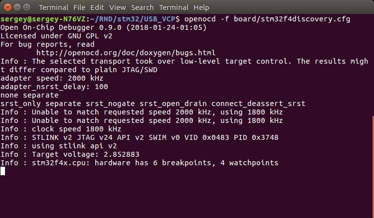

# OpenOCD for in-system programming
Here are some useful commands to deal with hardware. These examples are for STM32F4DISCOVERY board. For your specific device, you should use another .cfg file.  
**Run server**:  
```
openocd -f board/stm32f4discovery.cfg
```  
as a result you will see:
  
**Burn firmware into flash**:  
```
openocd -f board/stm32f4discovery.cfg -c "init ; reset halt ; program firmware.hex verify ; reset ; shutdown"
```
**Erase entire flash**:  
```
openocd -f board/stm32f4discovery.cfg -c "init ; reset halt ; stm32f4x mass_erase 0 ; shutdown"
```
