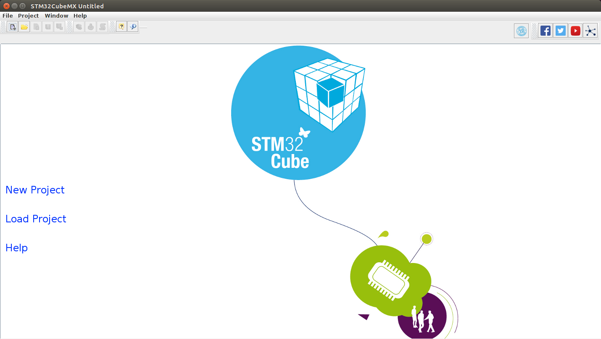
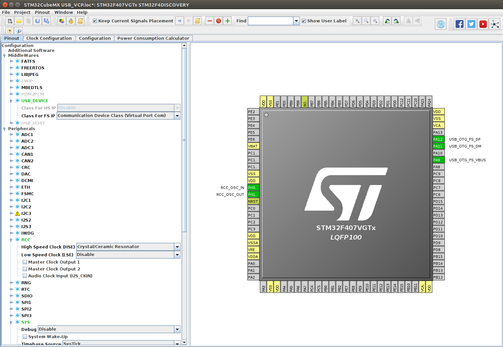
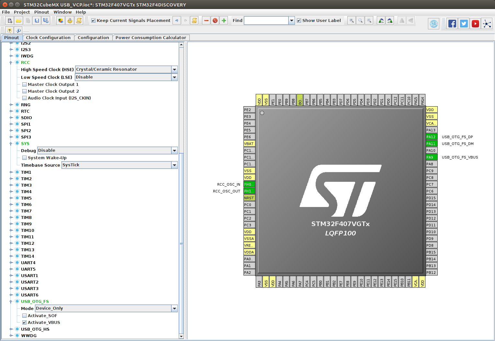
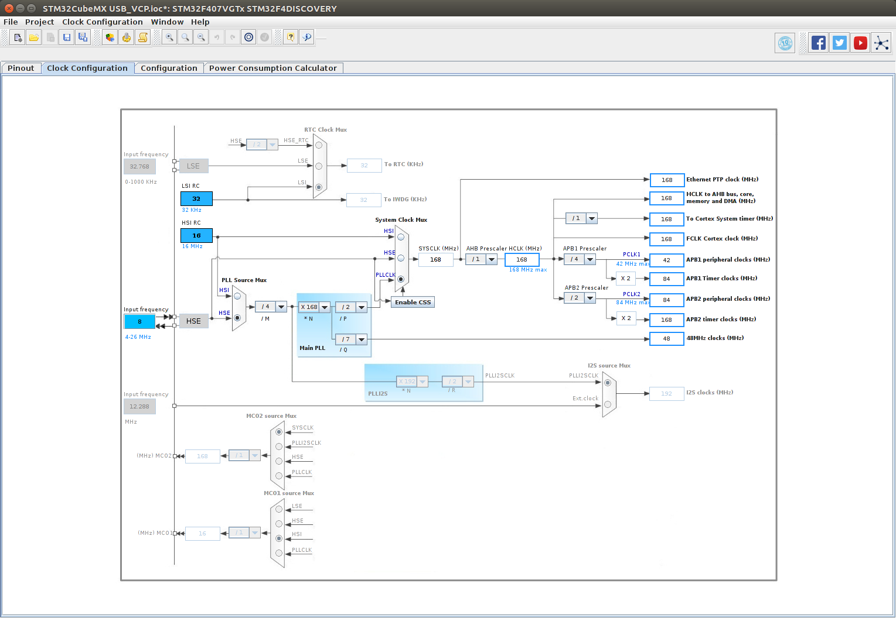
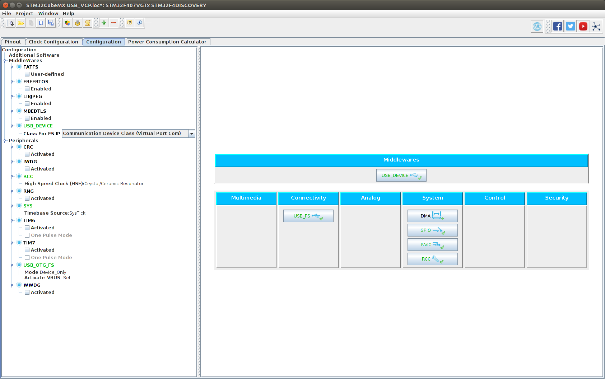
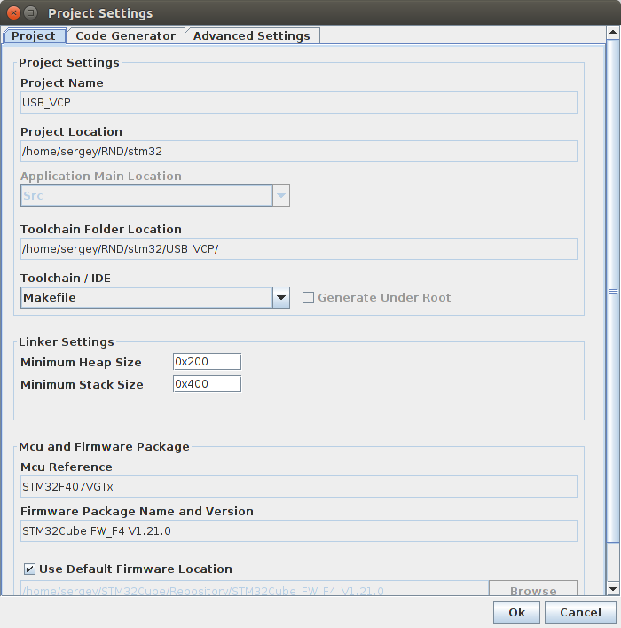
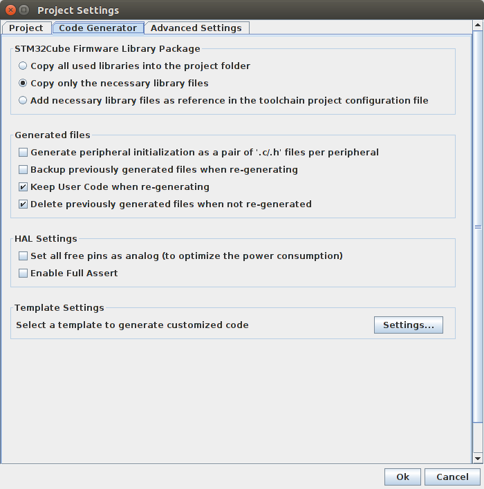
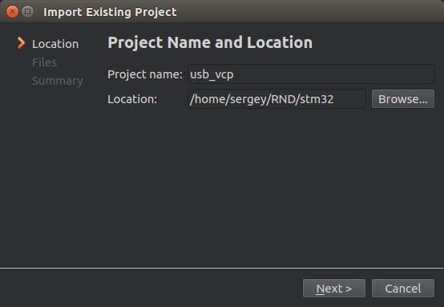
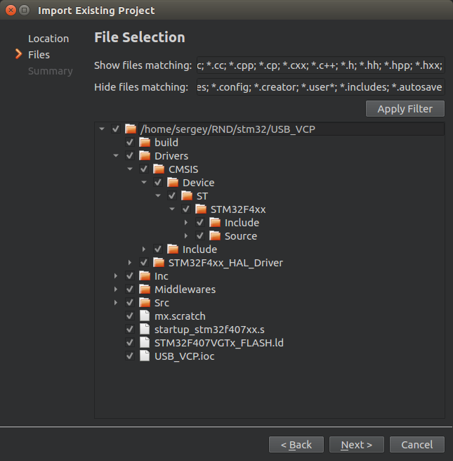
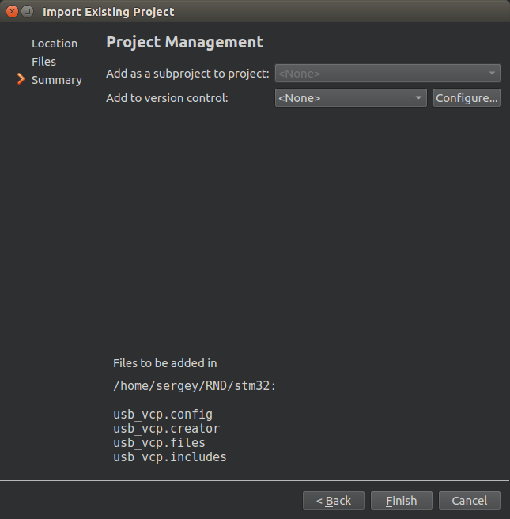

# Create a project with STM32CubeMX for QtCreator
Below we will create a virtual comport (CDC) project with STM32CubeMX and import project to QTCreateor. The final project you can find in the usb_vcp folder in this repository.
  
1. Run STM32CubeMX and start **New Project**  
  

2. Select **STM32F4DISCOVERY** for the project as shown on the picture 
 

3. Confure MCUs pins
 
 

4. Rifine clock configration
 

5. Configure **Middlewares** as shown on the picture
 

6. Go to menu **Project -> Settings** and configure the project. Here we use **Makefile** as toolchain. This important for importing into QtCreator.
  
also configure settings for **Code Generator**
 

7. Close **Project Settings**  window by click on Ok. And run **Generate Code** in **Project** menu.

8. Run **QtCreator** and goto menu **File -> New File or Porject**. Select **Import Project -> Import Existing Project**
 

9. Enter project name **usb_vcp** and location of project generated in previus step.
  

10. Select all files to be imported and click **Next**
  
click **Finish**  
  

11. Now we can see the opened project in QtCreator IDE
  
