# Setting up QtCreator environment

1. Open Help -> About Plugins. Find category Device Support and check BareMetal. 
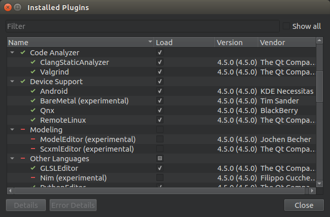

2. Open Tools -> Options. 
- Go to Devices -> Bare Metal. Then Click Add button and select OpenOCD. USe all settings on default.  
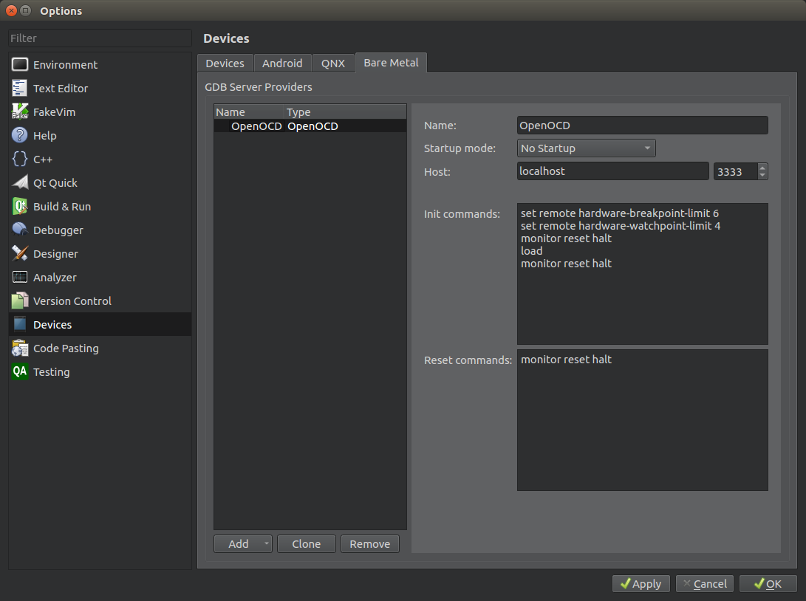  
When using **Startup Mode** as "No Startup" you will have to [start OpenOCD](openocd.md) server befor on-chip debugging.  
If you don't like to start it every time you should set it to "Startup in Pipe Mode"  
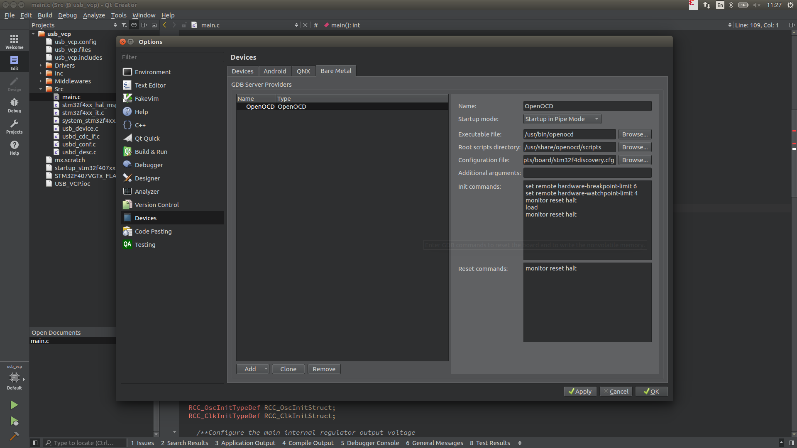  
or "Startup in TCP/IP Mode"  
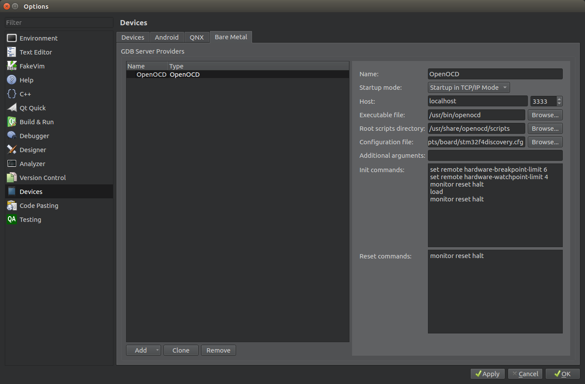  
In this window there is need to enter path to OpenOCD executable file and script directory.  
Here we use settings for STM32F4DISCOVERY board from STMicroelectronics. If you use another board you should specify your custom configuration file.  
- Go to Devices -> Devices. Add new device by clicking in Add button.  
Select **Bare Metal Device** and click **Start Wizard**  
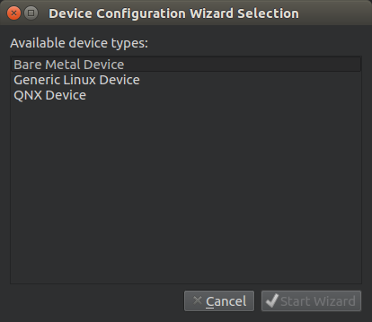  
Select **OpenOCD** as **GDB server provider** and click finish  
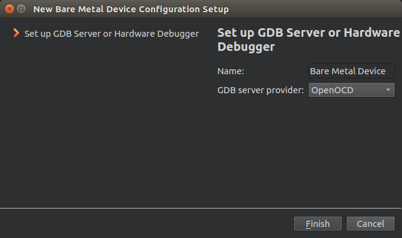  
As result all of this you create new Device  
  
- Go to Build & Run -> Debuggers. Click **Add** button and fiil in settings for new Debugger as shown on picture.  
Do it if you going to use manually [downloaded and compiled arm gdb with python support](readme.md).  
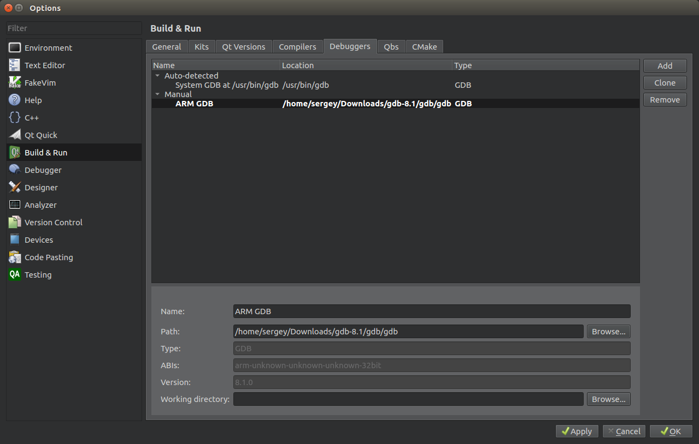  
If you decide to use gdb from gcc toolchain set path to **arm-none-eabi-gdb-py**:  
  
- Go to Build & Run -> Compilers. Create a new GCC compilers for C and C++. Call them as "ARM GCC" and "ARM G++" respectivly. For path use "/usr/bin/arm-none-eabi-gcc". Set "ABI" to arm-unknown-unknown-unknown-32bit.
 
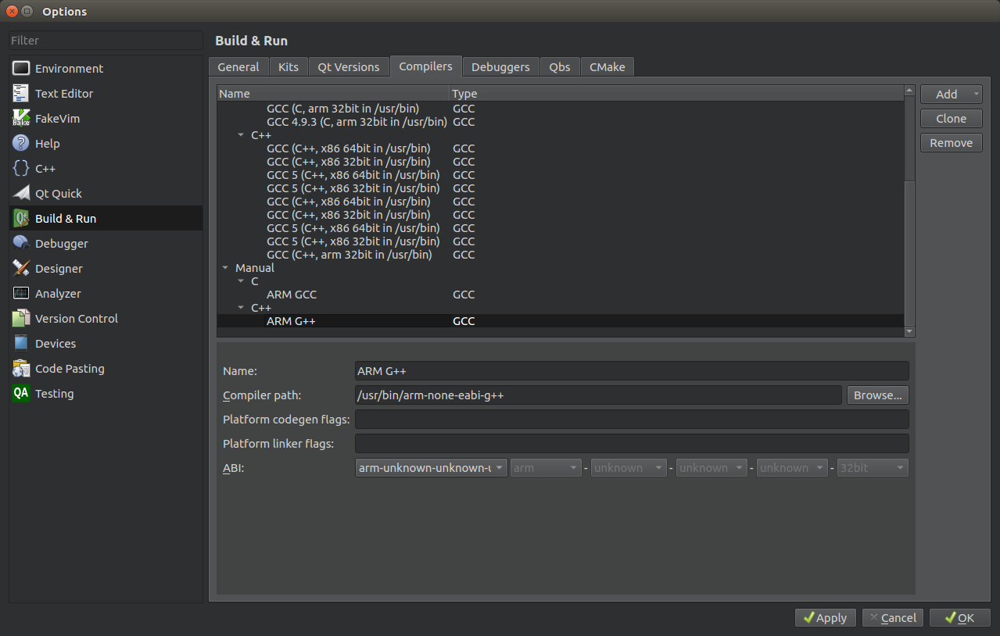 
If you decide to use dowloaded gcc toolchain from [launchpad](https://launchpad.net/gcc-arm-embedded/+download) do as follows:
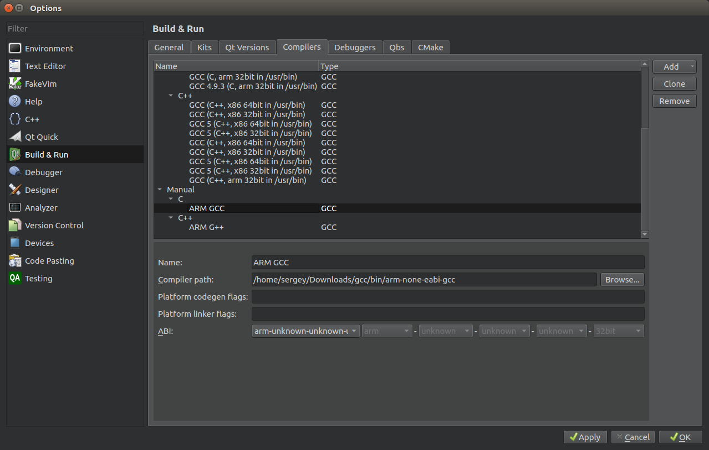 
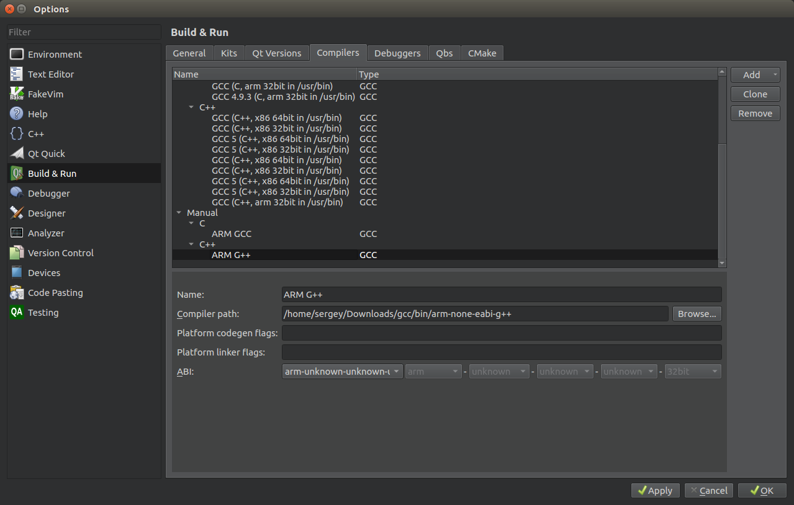
- Go to Build & Run -> Kits. Add a new kit. Call it **ARM Bare Metal**.  
**Device type**: Bare Metal Device  
**Device**:      point to the Device you have created with it's OpenOCD/St link GDB server  
**Compiler**:    ARM GCC and ARM G++  
**Debugger**:    ARM GDB  
**Qt Version**:  None  
Finally it should look like this
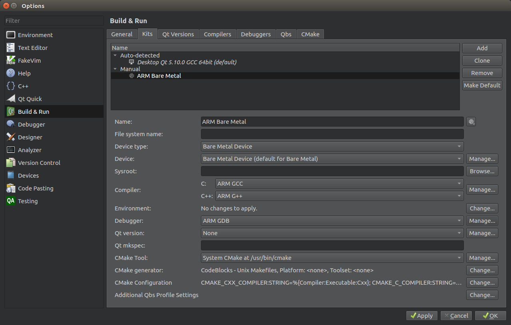
